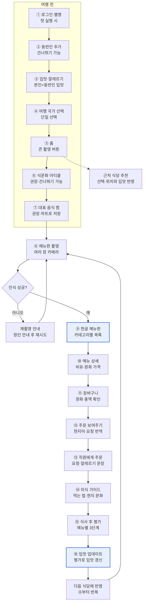

# 유저플로우 — 한국인의 감각으로 풀어주는 유럽 미식 가이드

Oct 4, 2026 · @노연주

## 전체 유저플로우

기능명세서의 8개 요구사항을 따라가면 사용자는 아홉 단계를 한 번 거치고, 평가로 쌓인 입맛이 다음 식당으로 이어진다. 홈에서는 위치 기반 근처 식당 추천(요구사항 2, 선택)으로 갈라질 수 있다. 설정(요구사항 8)은 흐름 밖에서 어느 단계에서든 들어갈 수 있다.

> 설정(마이페이지): 어느 단계에서든 입맛·알레르기·글씨 크기 수정 가능
> 강조된 칸: 차별점(한식 비유 메뉴판, 평가 기반 개인화)
