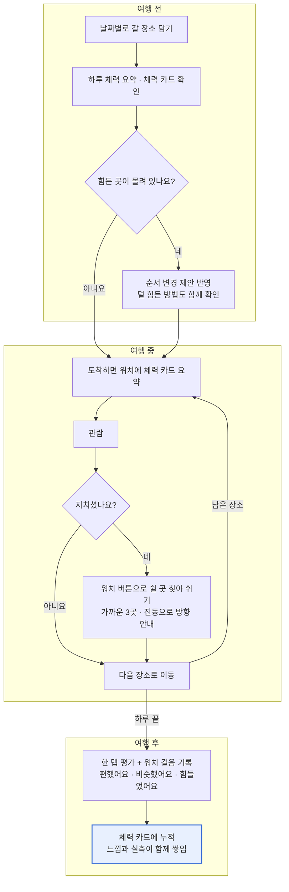

# 유저플로우

여행 전 일정을 담는 순간부터 여행 중 쉴 곳을 찾고, 다녀온 뒤 체감을 남기기까지의 흐름.

## 메인 플로우

힘든 곳은 여행 전에 미리 알고 순서를 조정하고, 현장에서 지치면 쉴 곳 지도로 바로 쉰다. 다녀온 뒤 남긴 평가는 다음 여행자의 체력 카드를 더 정확하게 만든다.

## 보조 플로우

### A. 일정 없이 쉴 곳만 찾는 경우

1. 홈의 "쉴 곳 찾기" 버튼을 누른다.
2. 현재 위치 근처의 벤치, 앉을 수 있는 실내, 화장실이 거리순으로 나온다.
3. 항목을 눌러 상세를 보고 \[길찾기\]로 지도 앱에서 안내를 받는다.

### B. 현장에서 처음 가는 장소를 확인하는 경우

1. 일정에 없던 장소를 검색한다.
2. 체력 카드와 덜 힘든 방법을 확인한다.
3. 힘들 것 같으면 들르지 않거나, 엘리베이터 입구 등 팁을 따라간다.

### C. 체감 평가를 남기는 경우

1. 방문한 장소가 있는 날 저녁 앱을 열면 "포로 로마노 어땠어요?"가 뜬다.
2. 편했어요 / 비슷했어요 / 힘들었어요 중 하나를 누른다. 건너뛸 수도 있다.
3. 평가는 해당 장소 체력 카드의 "사용자 평가"에 누적된다.

### D. 워치로 쉴 곳을 찾는 경우

1. 워치의 쉴 곳 버튼을 누르거나, 도착 요약 화면의 \[쉴 곳\]을 누른다.
2. 가장 가까운 쉴 곳 3곳이 종류와 도보 시간과 함께 뜬다.
3. 하나를 고르면 워치가 진동과 화살표로 방향을 안내하고, 폰에는 쉴 곳 상세가 열린다.
4. 워치가 없으면 폰의 "쉴 곳 찾기"로 같은 흐름을 쓴다.
